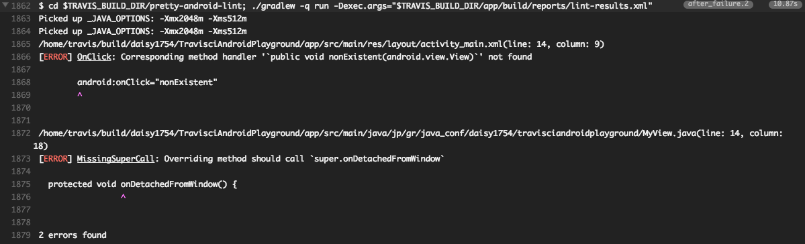

# android-pretty-lint
Simple tool to pretty print Android lint result.

[](https://travis-ci.org/daisy1754/pretty-android-lint)
[](https://opensource.org/licenses/MIT)


android-pretty-lint is a simple Java program that parses an output from Android lint and prints
errors in console. This is written in Java so no additional environment setup is needed.

## Setup with Travis CI

1. Copy pretty_android_lint.sh to your project
2. Make it executable by 
`chmod +x pretty_android_lint.sh`
3. Modify your `.travis.yml`

```
after_failure:
  - ./pretty_android_lint 
```

You'll now see lint error summary in travis log

